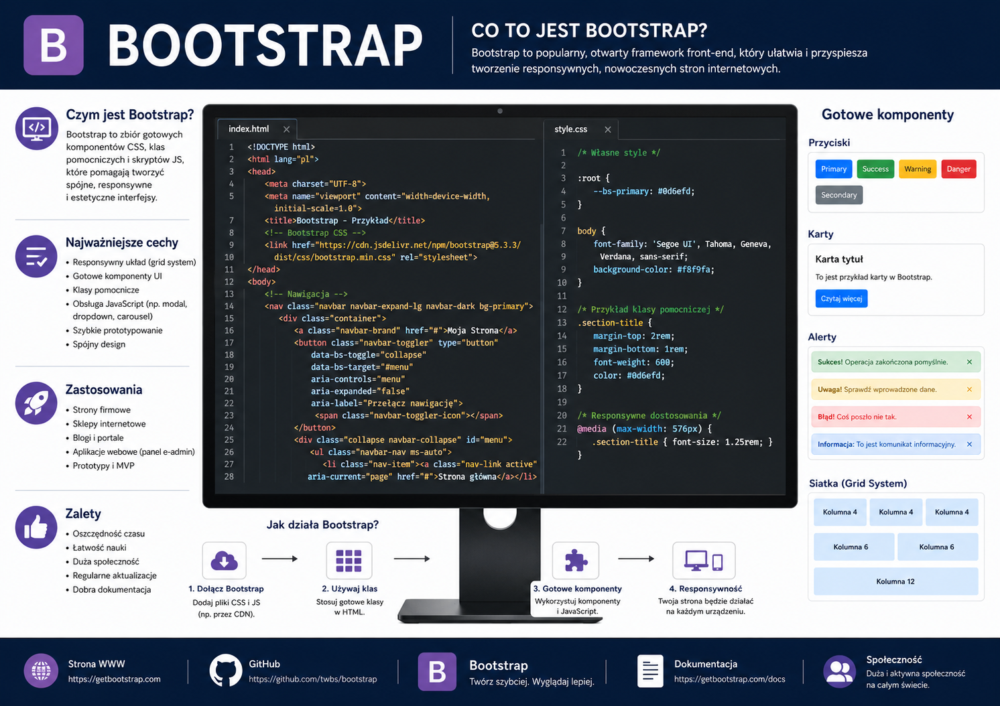
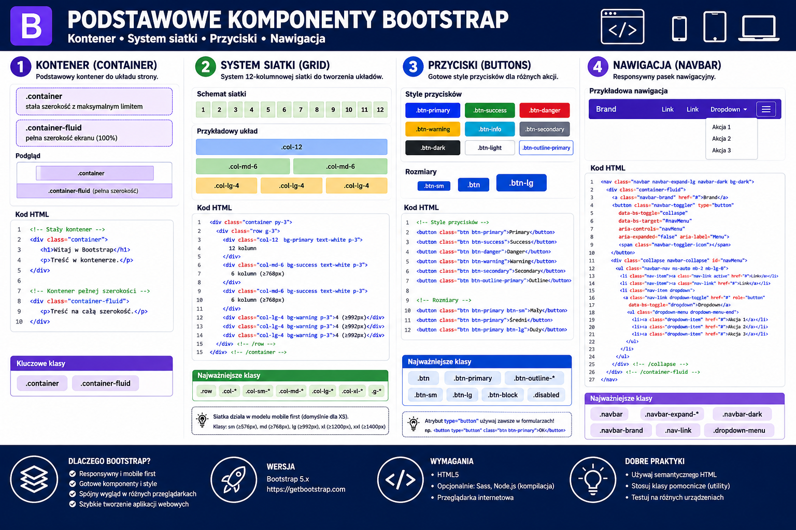
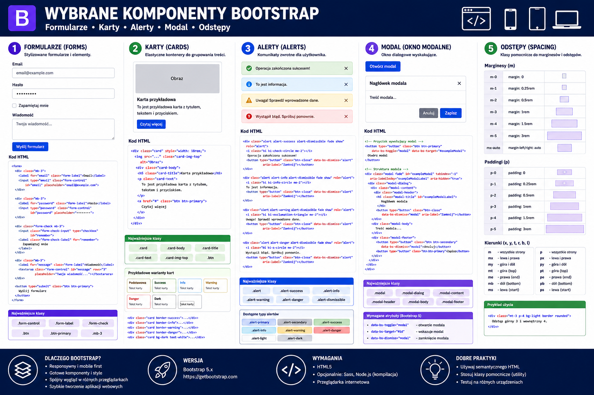
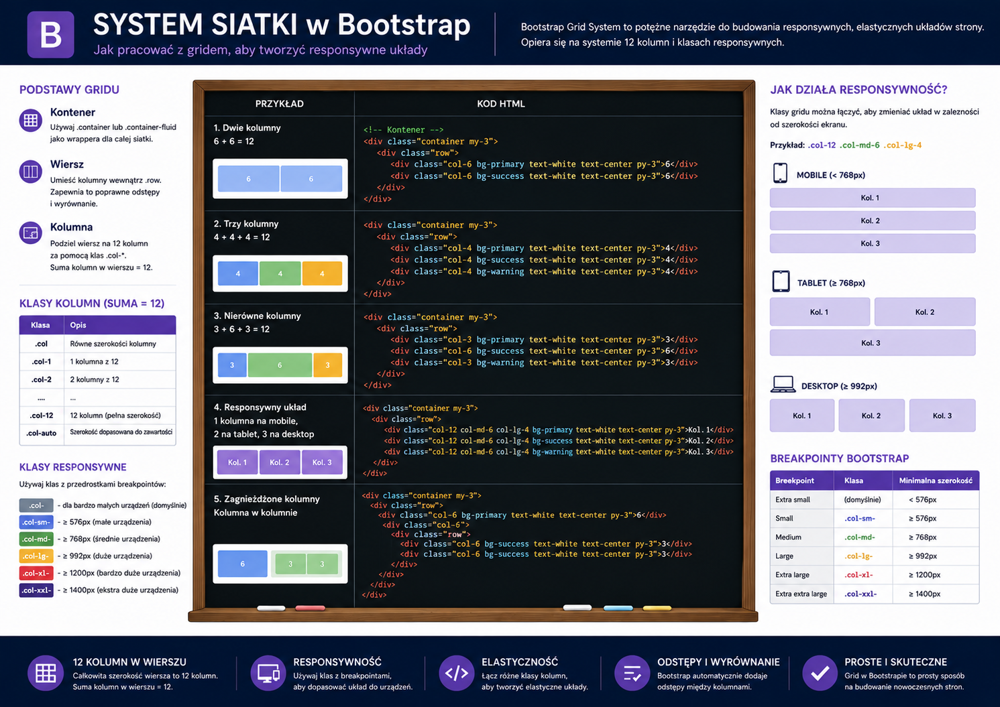
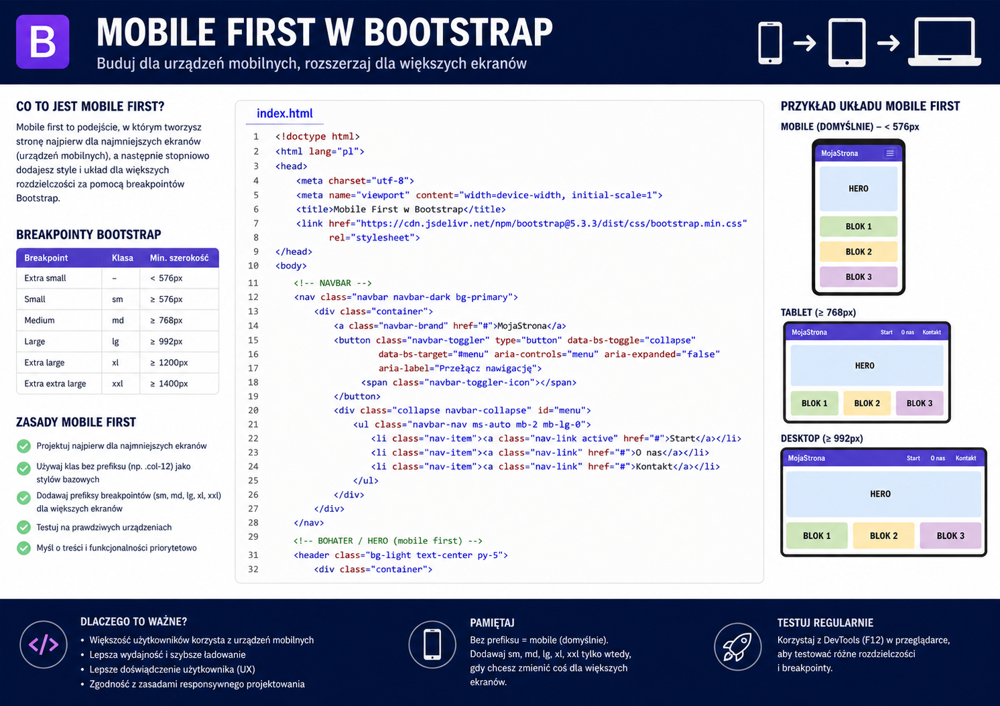
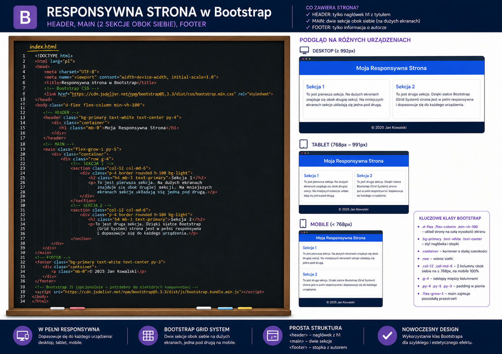

# 📚 Materiały dydaktyczne – Bootstrap

     
    <em>Plansza: Bootstrap - Wprowadzenie</em>

     
    <em>Plansza: Bootstrap - Komponenty: kontener, siatka, przyciski, nawigacja</em>

     
    <em>Plansza: Bootstrap - Komponenty: formularz, karta, alert, modal</em>

     
    <em>Plansza: Bootstrap - Podstawy siatki</em>

     
    <em>Plansza: Bootstrap - Podejście "mobile first"</em>

     
    <em>Plansza: Bootstrap - Responsywana stronw www</em>

