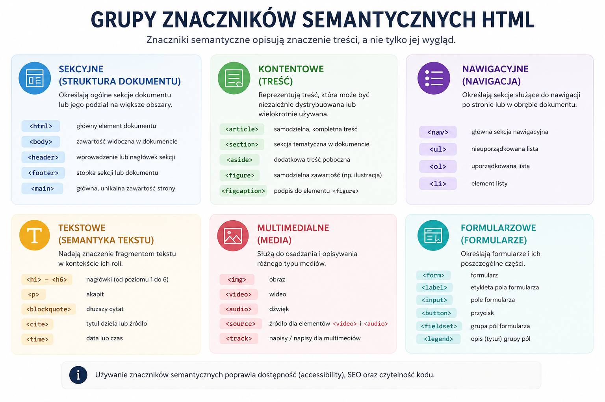
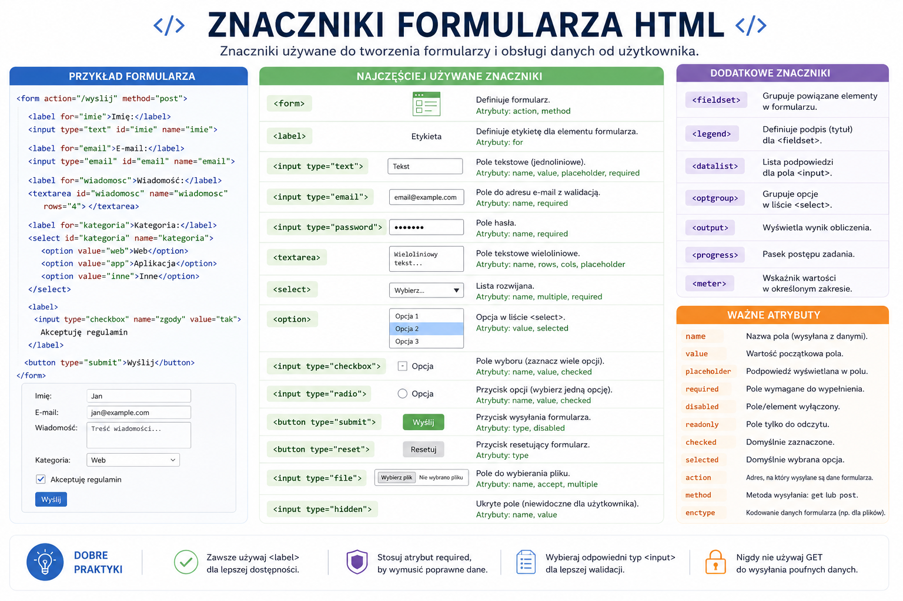
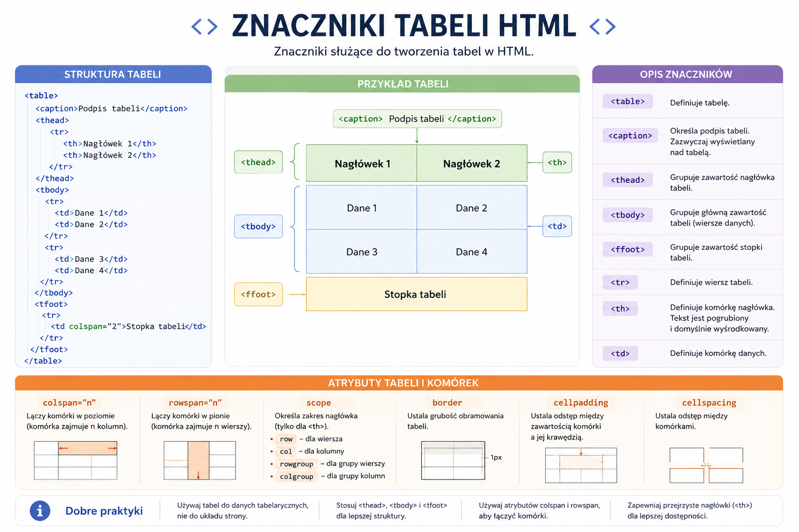

# 📚 Materiały dydaktyczne – HTML

     
    <em>Plansza: Znaczniki semantyczne HTML</em>

     
    <em>Plansza: Znaczniki formularza</em>

     
    <em>Plansza: Znaczniki input</em>

     
    <em>Plansza: Znaczniki tabeli</em>

     
    <em>Plansza: Znaczniki nawigacji strony</em>

