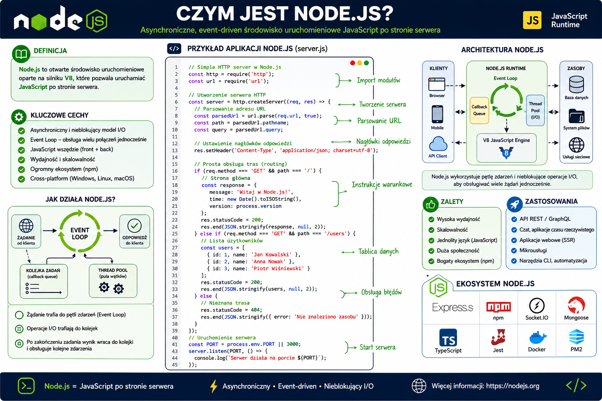
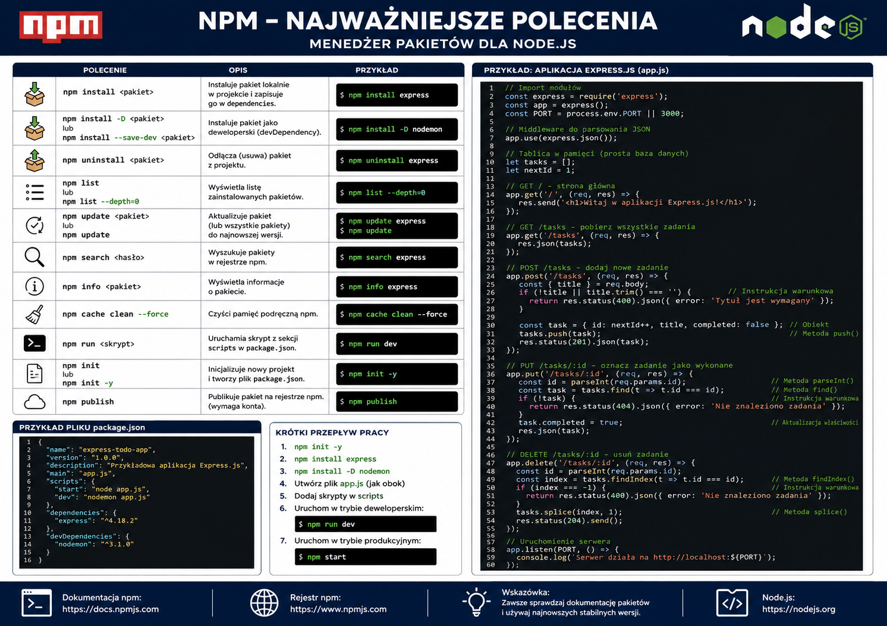
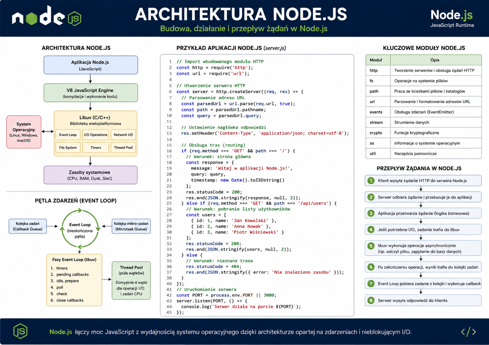
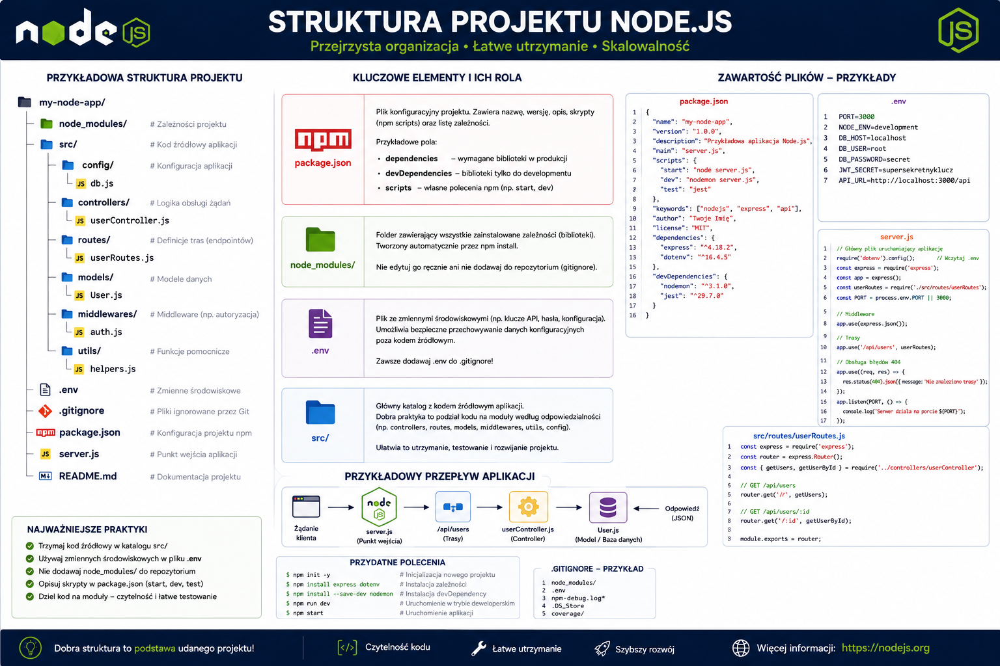
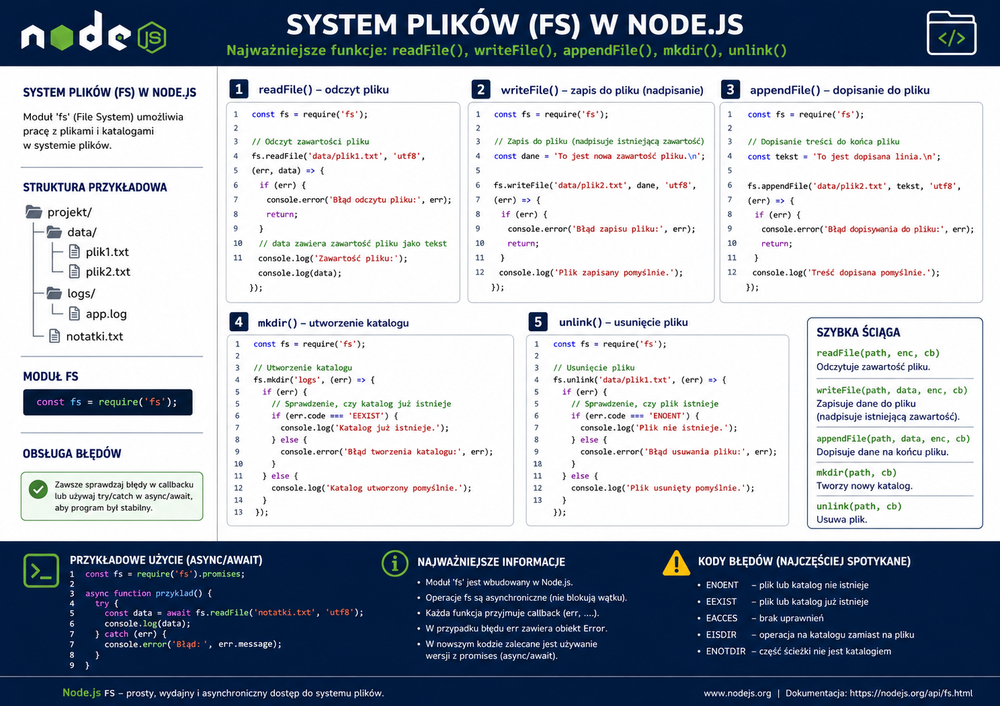
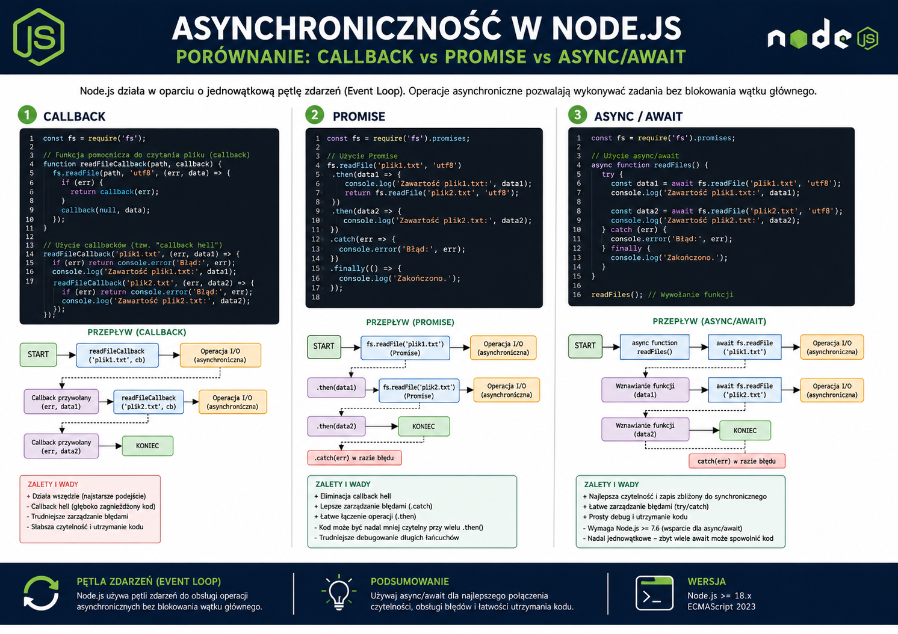
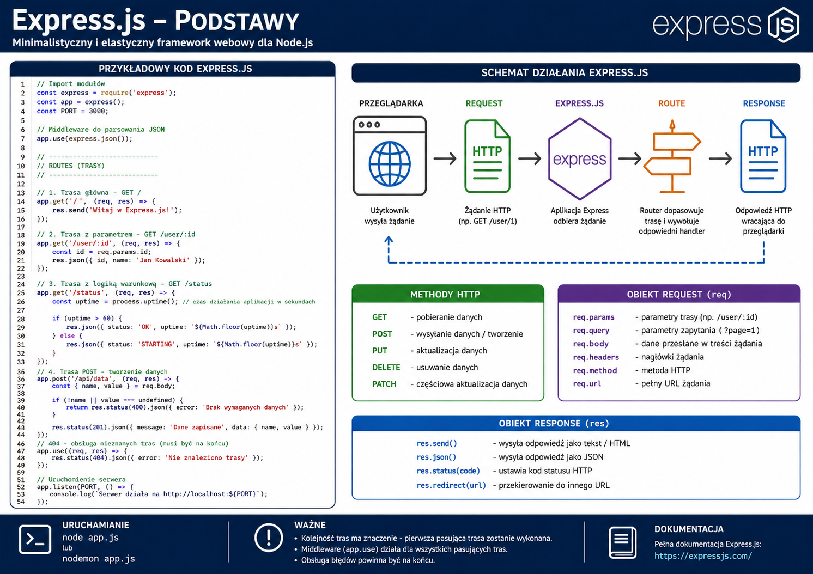

# 📚 Materiały dydaktyczne – Node

     
    <em>Plansza: Node - Wprowadzenie</em>

     
    <em>Plansza: Node - Najważniejsze polecenia</em>

     
    <em>Plansza: Node - Architektura</em>

     
    <em>Plansza: Node - Struktura projektu</em>

     
    <em>Plansza: Node - System plików</em>

     
    <em>Plansza: Node - Moduły: Commonjs i ES modules</em>

     
    <em>Plansza: Node - Asynchroniczność</em>

     
    <em>Plansza: Node - Express.js</em>

