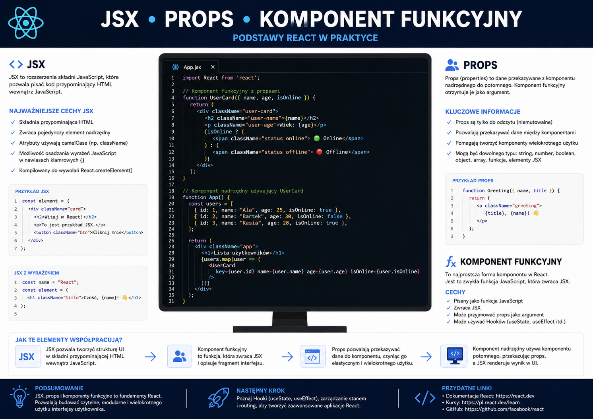
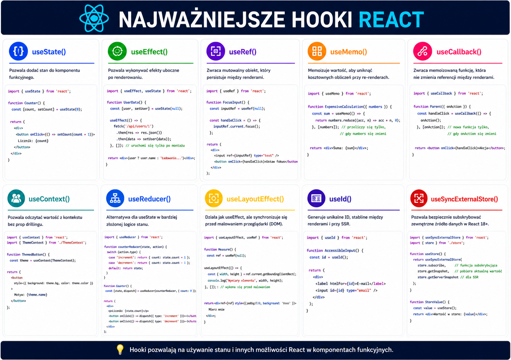
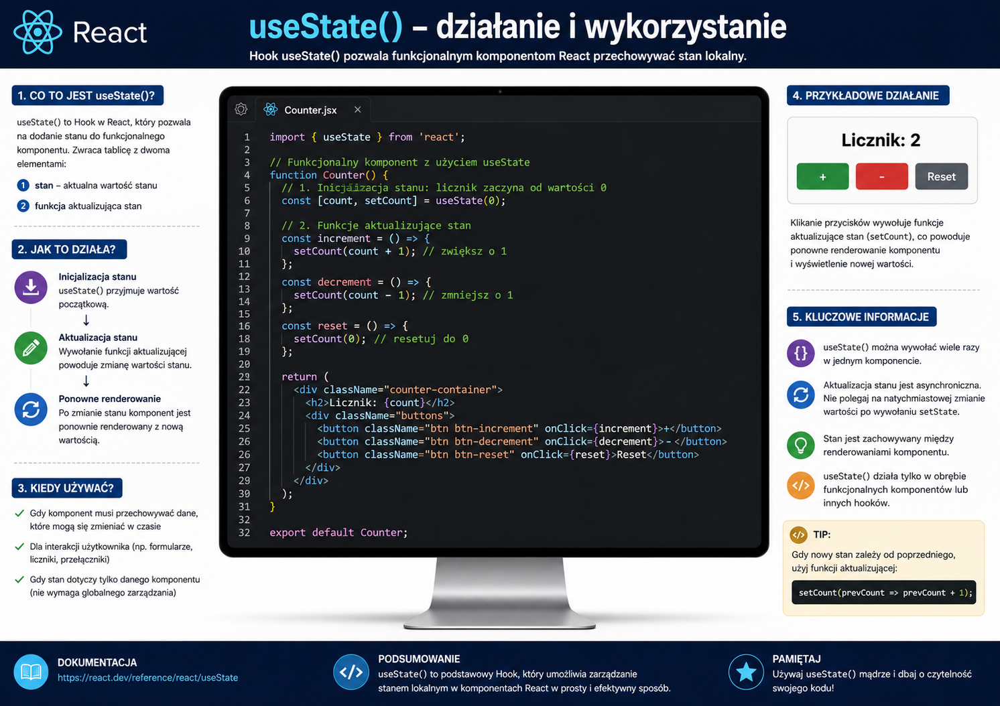
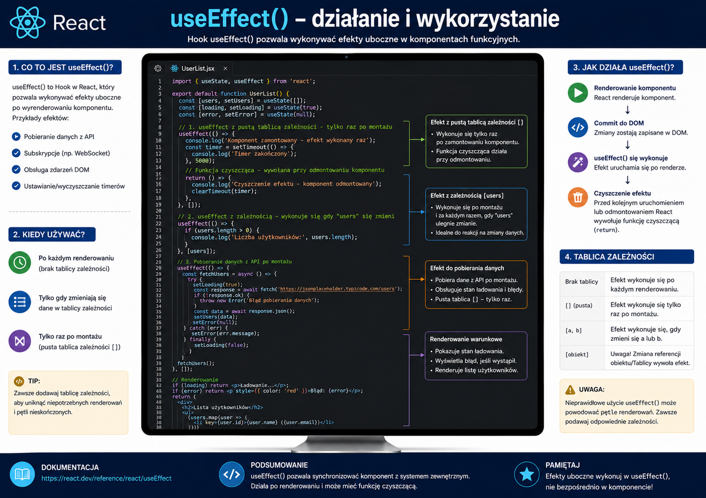
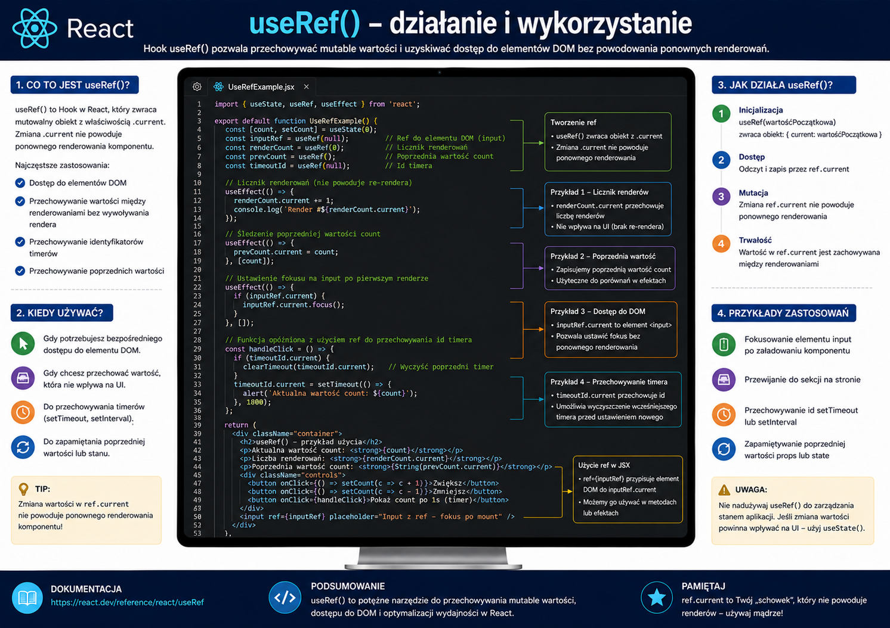
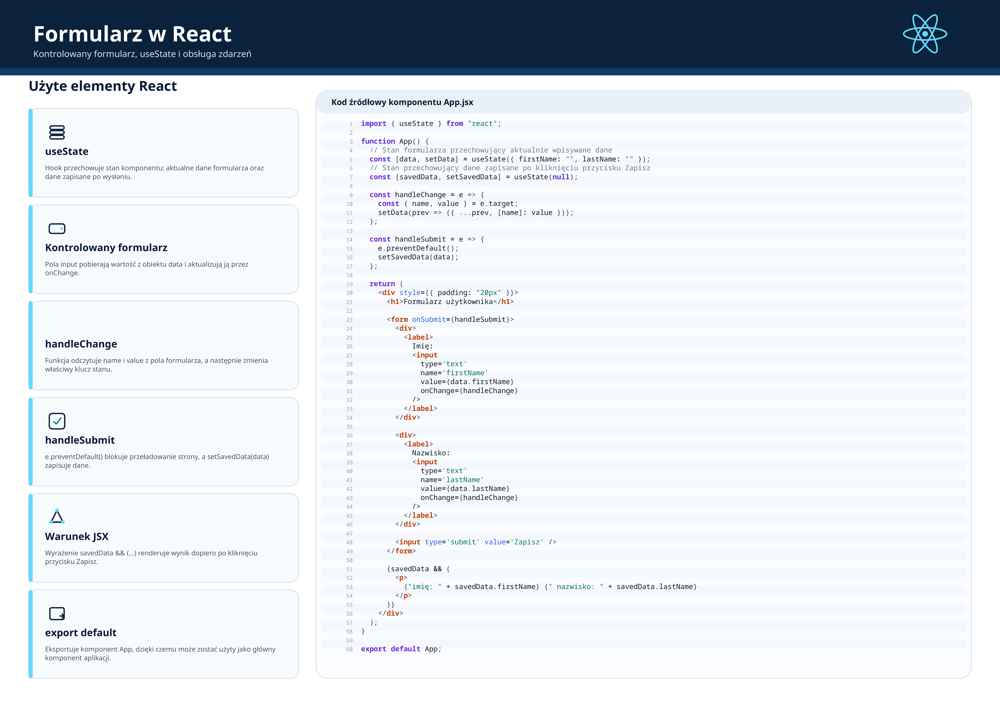
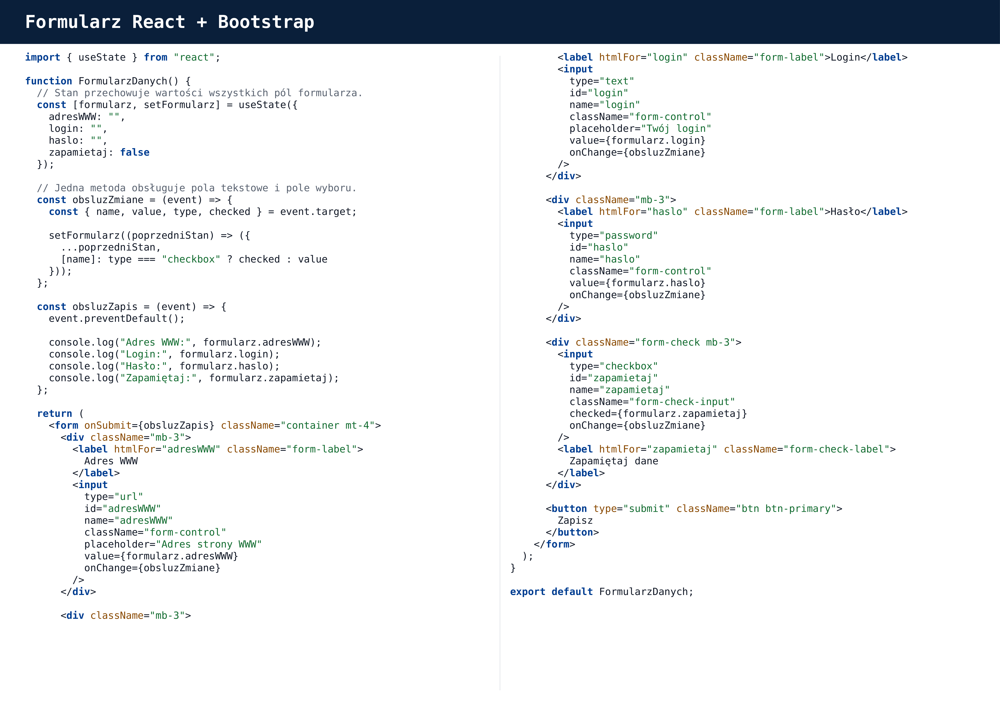

# 📚 Materiały dydaktyczne – React

     
    <em>Plansza: JSX, props i komponent funkcyjny</em>

     
    <em>Plansza: Najważniejsze hooki w React</em>

     
    <em>Plansza: Hook userState()</em>

     
    <em>Plansza: Hook useEffect()</em>

     
    <em>Plansza: Hook userId()</em>

     
    <em>Plansza: Hook userRef()</em>

     
    <em>Plansza: Formularz w React</em>

     
    <em>Plansza: Formularz w React z Bootstrap'em</em>

