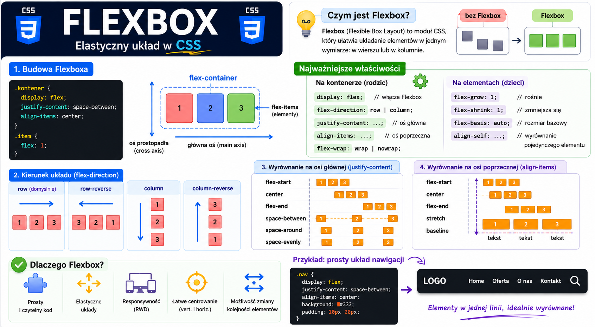
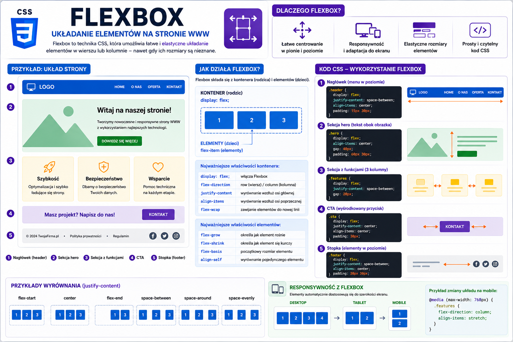
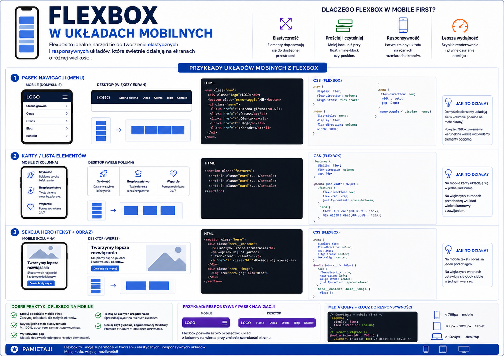
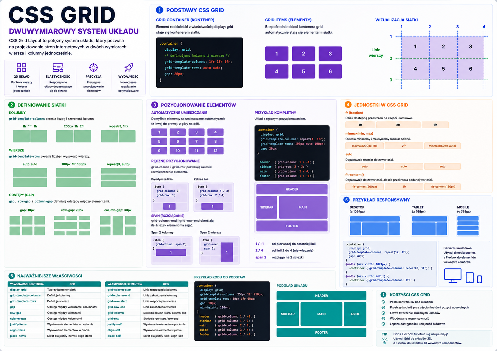
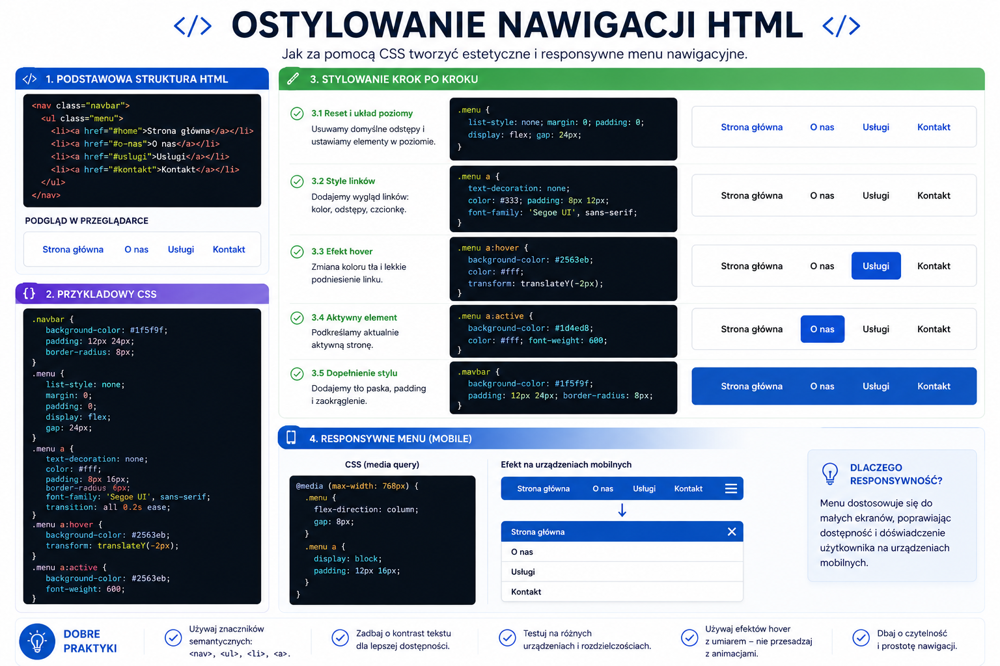

# 📚 Materiały dydaktyczne – RWD

     
    <em>Plansza: Zasady RWD</em>

     
    <em>Plansza: Podstawy flexbox</em>

     
    <em>Plansza: Flexbox i układanie elementów na stronie</em>

     
    <em>Plansza: Flexbox i układ mobilny</em>

     
    <em>Plansza: CSS Grid - podstawy</em>

     
    <em>Plansza: CSS nawigacja</em>

     
    <em>Plansza: JS nawigacja</em>

