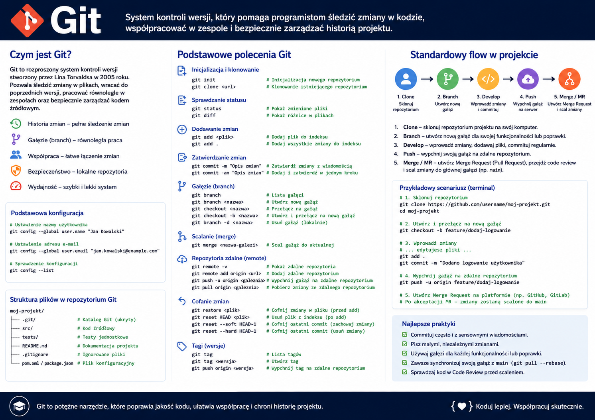
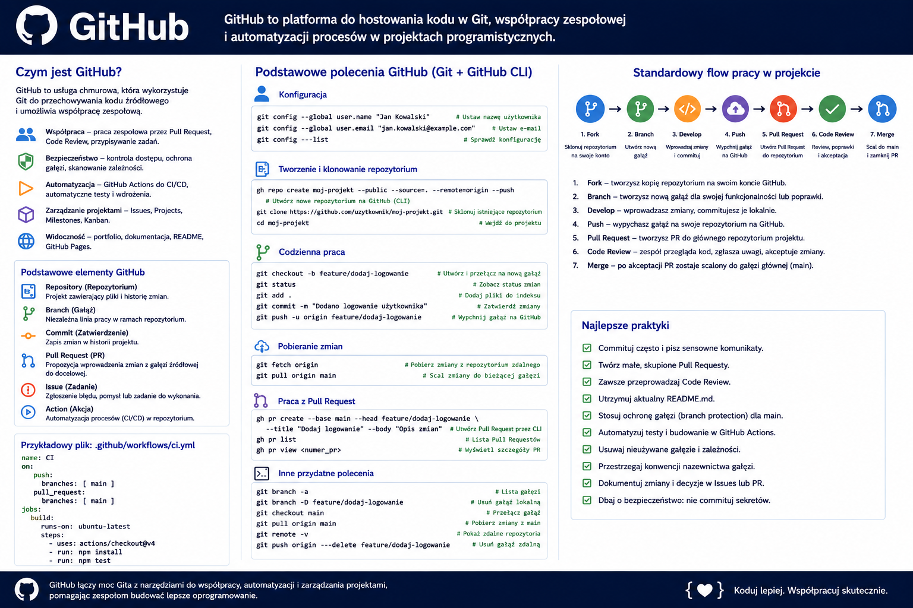
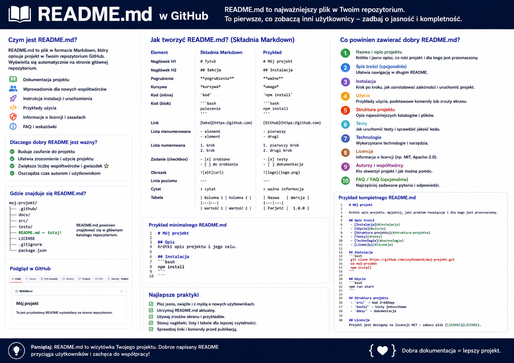
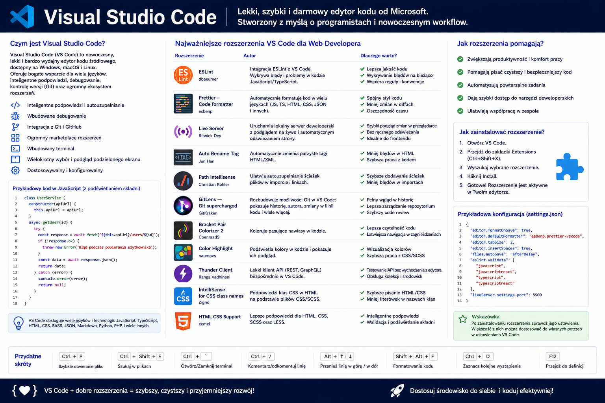
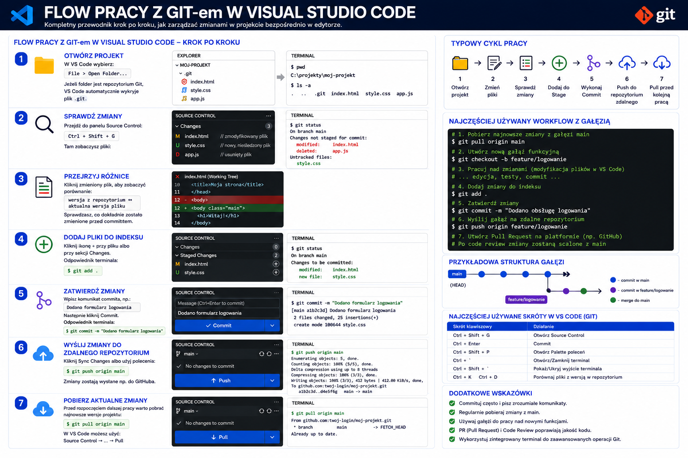
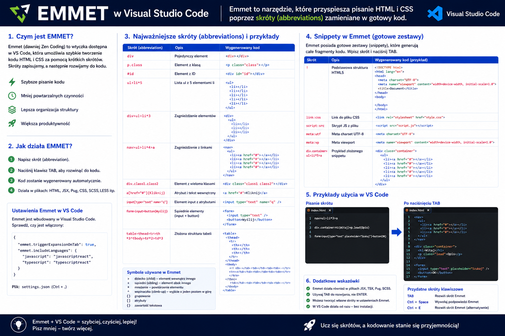
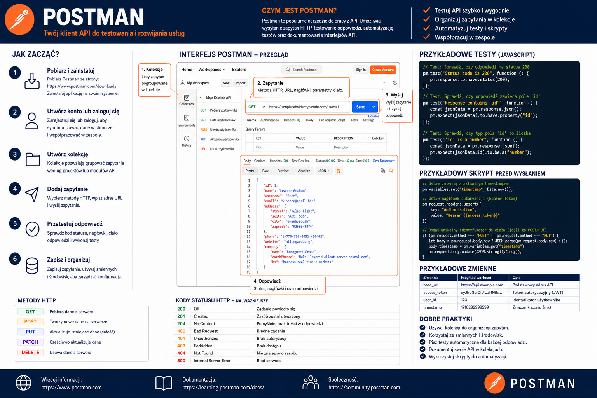

# 📚 Materiały dydaktyczne – Tools

     
    <em>Plansza: Git - Podstawy</em>

     
    <em>Plansza: GitHub - Podstawy</em>

     
    <em>Plansza: GitHub - README</em>

     
    <em>Plansza: Visual Studio Code - Wprowadzenie</em>

     
    <em>Plansza: Visual Studio Code - Flow pracy z Git</em>

     
    <em>Plansza: Visual Studio Code - EMMET</em>

     
    <em>Plansza: Postman - Wprowadzenie</em>

